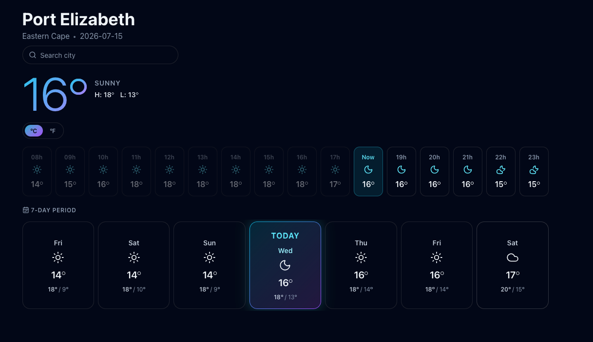
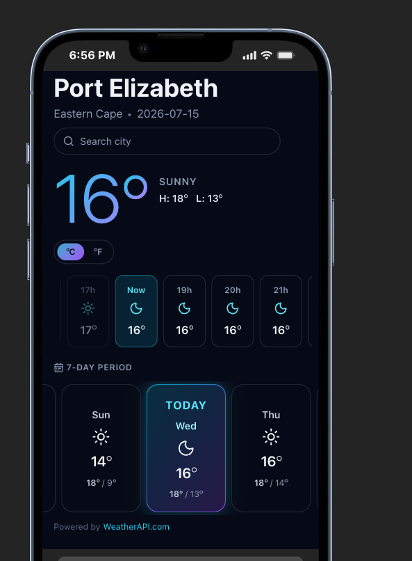
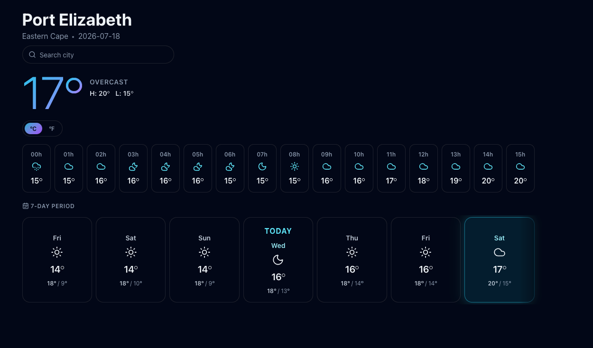
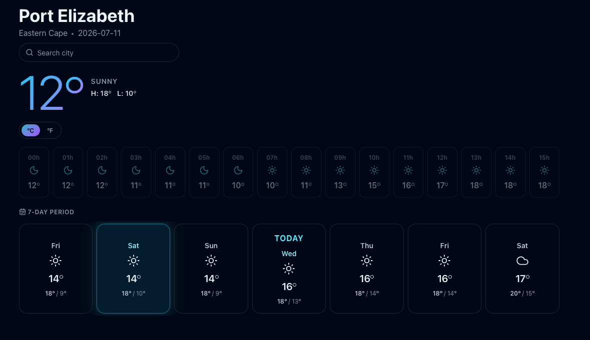
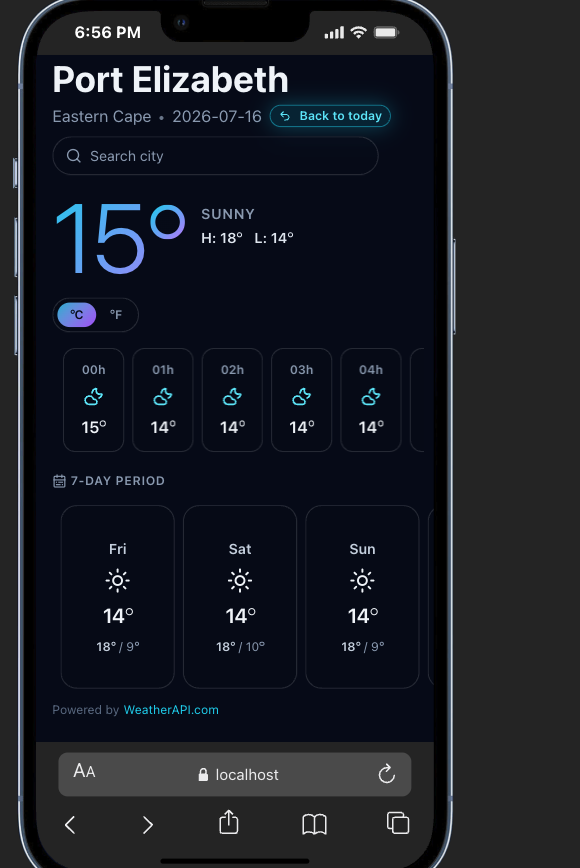

# Deliverable

## How it's put together

The `src/` folder is grouped by responsibility rather than by feature:

- `api/client.ts` talks to WeatherAPI. It reads the `VITE_USE_MOCK_DATA` flag and either fetches over HTTP or returns the bundled JSON, so the rest of the app never knows which it got.
- `types/api.ts` describes the raw WeatherAPI response shape. `types/weather.ts` describes the shape the UI actually wants.
- `mappers/` converts one into the other. Nothing above this layer touches a raw API field, so a change to the API surface stops at the mapper.
- `formatters/time.ts` holds the date and time logic.
- `hooks/useWeather.ts` owns the load / loading / error / ready state for a location.
- `components/` are presentational and take already-mapped data.

The build order followed the same priority as the code layout:
get one real thing on screen, then peel reusable pieces out of it.
The hero temperature block went in first and was wired straight into the app.
The loading and error state came out next, then a small `Separator` component to keep the markup readable.
LocationHeader and CitySearch followed, then a `Temperature` component (see the degree symbol note below),
then the hourly strip, then the multi-day rail, and finally the wiring that lets a selected day drive every section at once.

## Why WeatherAPI.com instead of WeatherStack

The original assessment names WeatherStack's free tier as the data source,
and asks for a 3-day forecast plus 3-day history alongside current conditions.
Those two requirements do not fit on WeatherStack's free plan.

WeatherStack's Free plan gives real-time weather only, capped at 100 calls a month.
Forecast data sits behind the Professional plan at \$49.99 a month.
Historical data sits behind the Standard plan at \$9.99 a month.
(Source: [WeatherStack Pricing](https://weatherstack.com/pricing), checked July 2026)

Rather than pay for a plan or stitch together two providers for one app,
I moved current weather, forecast, and history onto WeatherAPI.com.
Its Free plan allows 100,000 calls a month, a 3-day forecast, 1 day of historical data,
and permits commercial use. (Source: [WeatherAPI Pricing](https://www.weatherapi.com/pricing.aspx))
That's 1,000 times WeatherStack's free call allowance, from a single response shape instead of two.

### Covering the extra 2 days of history

> ⚠️ UPDATE
> After exploring the API a little, I see that the WeatherAPI.com allows you to get history for any day
> The pricing page was a little confusing/misleading with this; and I'm still not exactly sure what they meant by only getting a single day's history.
> It's possible that you can only get a single day of history at a time - which is likely what that item on the pricing page means.
> But, because we are able to get history for a day, but just calling the api for that specific day, we'll always have all 3 days showing correctly from the start.
> The thing that doesn't change, is that we will continue to cache history weather, since it's in the past, it can't change.

## Mock data for development

100,000 calls a month is generous, but restarting the dev server or refreshing the browser while working on the UI can add up fast.
For this reason, the app uses some mock data, which can be found in `src/mock`.
The mock data doesn't just emulate the WeatherAPI.com's response, it is a statically/manually pulled list of data.

With `VITE_USE_MOCK_DATA=true`, `pnpm run dev` renders the app against the sample payloads in `src/mock/`. Search works too; try "port" or "durban".

## Design decisions and trade-offs

**Two type layers, mapped in the middle.**
The raw WeatherAPI response carries a lot of fields the UI doesn't need,
with names like `feelslike_c` and `daily_will_it_rain`.
Rather than pass that shape around, there's an API type and a UI type, with a mapper between them.
It's a bit more code up front.
The payoff is that components read clean domain objects, temperatures carry both `c` and `f` so the unit toggle is instant with no recomputation,
and any future API change is contained to one file.

**A flag decides mock vs live, not a code branch.**
`VITE_USE_MOCK_DATA` swaps the data source inside the client.
The reason it exists is the free tier: 100k calls a month is generous, 
but a hot-reloading dev server fanning out history requests eats into that fast, 
and it means the app runs with zero setup for anyone reviewing it.
The bundled sample is a real WeatherAPI payload, so mock and live exercise the same mappers and components.

**History is fetched one day at a time.**
The free tier rejects a date range on `history.json`, 
so past days are requested individually and merged with the forecast into a single sorted list.
Those requests run through `Promise.allSettled`, so if a history day fails,
the rail just shows fewer past tiles instead of the whole showing an error.
A shorter rail of actual weather is much better than no weather at all.

**Custom degree symbol instead of the Unicode character.**
The `Temperature` component renders the degree mark as a styled element rather than the `°` glyph.
That's what lets the big hero number carry the aqua-to-purple gradient cleanly and
keeps the mark sized and positioned consistently everywhere it appears, 
rather than relying on how a given font draws the character.

**Dates and times, no external library.**
This was the part that fought back against me.
Timezone-correct "is this hour in the past", or "is this day today" and API date formatting are the reasons date libraries exist.
But the surface area here is small, so instead of pulling in a dependency,
I decided to use the browser's built in `Intl` API with plain string and 
UTC arithmetic in `formatters/time.ts`.
To be honest, this decision took me longer than I would have liked, and in retrospect, I should have just gone for the library, but nonetheless.
For a project this size the trade felt right: including a big library to handle simple,
small amounts of date manipulation would have added extra bundle weight. 
The resulting logic just sits in one readable file.
On a larger app (and definitely as this app grows itself), I'd definitely be reaching for a library to handle that;
because no-one wants to sit and debug date and time, at any time of the day 🌚

**Tailwind v4, no config file.**
Styling is Tailwind v4, all theme information lives in a `@theme` block in `index.css`.
My chosen color palette (aqua, purple, slate), the glass surfaces and 
the glow shadows are all defined there as custom properties.
I make use of `@utility` classes in the file to allow for applying styles to parts of the UI seamlessly, as Tailwind intends.

**Using code generation to map WeatherAPI codes to Icons.**
This was a huge win for the style of the app. I asked Claude to help me put together a list of WeatherAPI codes (of weather conditions),
for a mapping to Lucide icons. Why would I do this? The "image" provided by WeatherAPI is a `.png` file.
This means that there is no control over its color or how it's displayed in the overall typography of the site.
Having a code from their condition, allows a mapping from the condition type to a lucide available icon.
This means that we can have our typography match the style even with the conditions. This was a huge win.

## Scope: what was cut, and why

The assessment asked for a production-ready front-end that displays weather,
with attention to clean code, testing and prioritization.
I treated that last word as the instruction it is.
It was a busy week, so I chose to ship the core experience solidly and
keep it clean rather than spread the same hours across every idea from my original design.

The initial design (the idea that I planned out over the weekend) went wider than what's here.

### What Did I Cut?

The items that were cut from my original design are still planned improvements;
and you may seem some remnants of it in the code, like a reference to `Scene` information.
To fit the timeline, the following items were dropped:

- **Full-bleed animated scene backgrounds.**
  The design had per-condition backgrounds that changed with the weather and time of day,
  with animated rain, wind gusts and lightning layered on top.
  The condition-to-scene mapping and the day/night `is_day` handling are still in the code;
  the backgrounds and effects themselves came out.
- **Sunrise / sunset section** with a live sun-position arc.
- **Country flags** in the search results.
- **A live clock in the location's timezone** ticking every 30 seconds,
  plus persisting the last city and unit to `localStorage`.

These were deliberate drops, not loose ends.
The result is a focused app that does the core job well,
which I'd rather hand over than a wider one held together loosely.

Having received this as an assignment and getting stuck into it,
it really has turned into a personal side project;
which I've really enjoyed working on.
So the cut features are on my backlog.
And this is a real backlog, not those "put it on the backlog" meme's >.<

### A note on caching and service workers

The original plan included a caching layer, using `localStorage` and `IndexedDB` for TTL-based API-call management,
a daily snapshot to bridge the free tier's 1-day history limit,
as well as a service worker for offline support.
That didn't make it in.

I'd rather be straight about why than dress it up.
I ran out of time this week, and it's an area I haven't worked in hands-on for a couple of years.
My focus has been backend for a long stretch; my working knowledge of wiring up caching in this way and using a service worker
isn't where I'd want it to be before shipping it into a codebase I'm asking you to judge.
I didn't want to bolt on something half-understood.

> For context on how I close gaps like this:
> 
> I joined my current team with zero React experience and was contributing meaningfully by the second week. I pick things up fast, and I'd rather learn a thing properly than fake fluency in it. The caching design is sketched out in my head; I just haven't earned the right to claim it's done.

## Screenshots

Some screenshots of the application in both desktop and mobile form can be found in the `docs/screenshots` folder.

### Highlights

*A view of the desktop for "Today"*

*A view of the mobile for "Today"*

*A view into the future forecast days on Desktop*

*A view of the desktop for historical weather*

*A view of the mobile for a forecasted day in the future*
